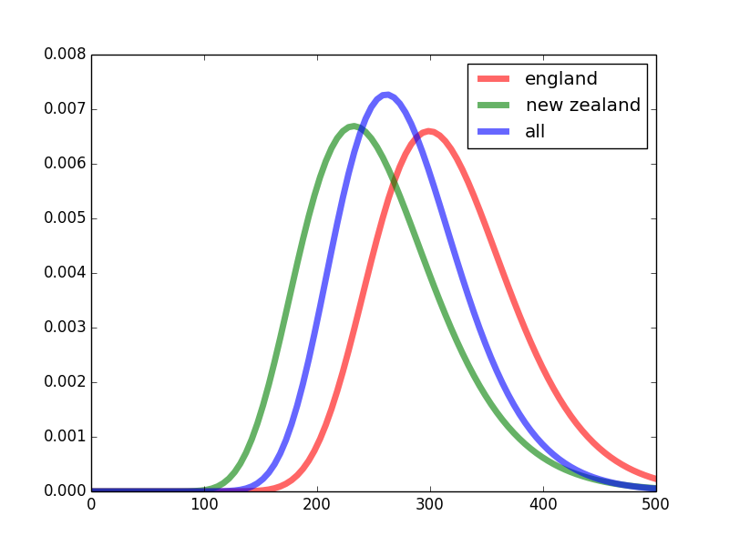

# What is the probability that a Cricket game will end in a tie?

I was completely blown away by the ICC World Cup Final 2019 between England and New Zealand that ended up in a tie. I couldn't help but wonder what is the probability that a cricket match will end up in a tie?

There is a long process of mental thinking I went through but I will just summarize the conclusion here i.e., give the TL;DR.

To answer, we can model the runs scored by a team in the match as sum of random variables. If there is 50 overs played with no wide or no-balls, there will be 300 random variables. If the variables were i.i.d., then the Central Limit Theorem guarantees that the sum would be normally distributed. The sum cannot be less than zero, so we instead choose to model with a lognormal distribution.

We create a lognormal distribution from the scores of England and do the same for New Zealand. Then probability of tie will be given by the integral of the cross correlation function. Let's do it!

[scores.py](scores.py) contains scores of england, nz, and all the teams irrespective of nationality. We have done some filtering so as to only include scores from 50 overs matches. The scores were obtained from Google.

[prob.py](prob.py) contains the code to do all the calculations.

Here we go!

```
>>> import prob as t
>>> import scores
>>> t.calculate(scores.en, scores.nz)
(0.0034365662488090296, 1.4083674421052884e-08)
```
so its less than 1% as my gut feeling said, and about 0.3%. Rare, but not so rare as to be a black swan event. A black swan event has 1 in a million chances or less to happen.

If we assume all teams are more or less equally good, we can approximate the pdf much better as suddenly a lot more data points are available. If we do that we get:

```
>>> t.calculate(scores.all, scores.all)
(0.005086769066800063, 3.499114196912595e-09)
```

0.5% or a 1 in 200 chance of happening

According to [ESPNcricinfo](http://stats.espncricinfo.com/ci/content/records/283892.html) the ratio of the number of tied ODI to the total number of ODIs is 38/4192 = 0.0090 or 0.9%.
Not bad. Certainly much better than calculations theoretical physicists are capable of doing 
[<a href="https://aapt.scitation.org/doi/10.1119/1.17850" target="_blank">1</a>]. The calculations and data I compiled were admittedly done in a hurry so I wouldn't be surprised of a bug here and there.

[plot.py](plot.py) contains code to plot the pdf:


Nearly everyone was expecting England to win, and they eventually did, but what a chase NZ gave them for the Cup!
