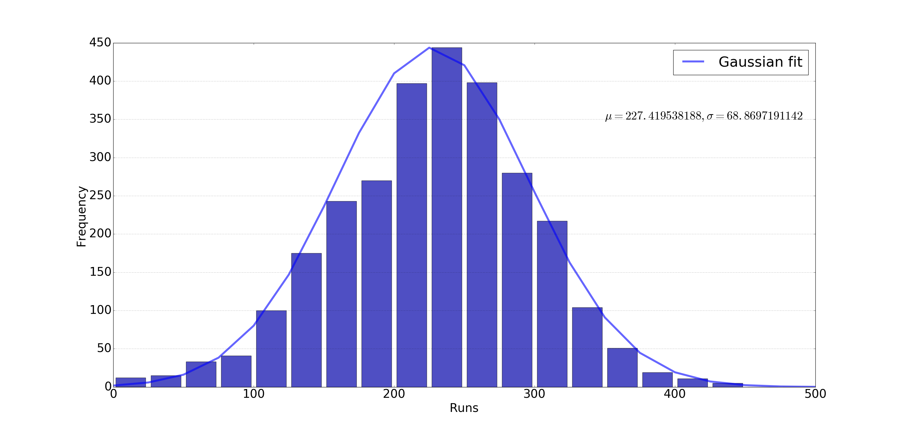

# Format of odi_stats.txt

`odi_stats.txt` created by running:
```
mvn exec:java -Dexec.mainClass="cricket.CalcStats" -Dexec.args="../odis" > odi_stats.txt
```
the directory `../odis` is created by unzipping `odis.zip`

Example record:
```
953343_1 152 104 7 2 19 0 8 0 299 3 10
```

* Column 1: {match}_{inning}
* Column 2: # of balls that resulted in 0 runs
* Column 3: # of balls that resulted in 1 runs
* Column 4: # of balls that resulted in 2 runs
* Column 5: # of balls that resulted in 3 runs
* Column 6: # of balls that resulted in 4 runs
* Column 7: # of balls that resulted in 5 runs
* Column 8: # of balls that resulted in 6 runs
* Column 9: # of balls that resulted in 7 runs. There are many balls in the dataset that result
  in 7 runs due to batsman hitting a six and it being a no ball e.g.
* Column 10: # of valid balls bowled
* Column 11: # of no-balls and wides (these need to be bowled again)
* Column 12: # of wickets (outs)

# Format of odi_prob.txt

`odi_prob.txt` created by running:
```
mvn exec:java -Dexec.mainClass="cricket.CalcProb" -Dexec.args="odi_stats.txt" > odi_prob.txt
```

Example record:
```
657637_1 0.4191 0.3927 0.0561 0.0033 0.0627 0.0033 0.0462 0.0000 0.0165 0.0099 1.0000
```

* Column 1: {match}_{inning}
* Column 2: Prob of scoring 0 runs
* Column 3: Prob of scoring 1 runs
* Column 3: Prob of scoring 2 runs
* Column 4: Prob of scoring 3 runs
* Column 5: Prob of scoring 4 runs
* Column 6: Prob of scoring 5 runs
* Column 7: Prob of scoring 6 runs
* Column 8: Prob of scoring 7 runs
* Column 9: Prob of getting out
* Column 10: Prob of ball needs to be bowled again (no balls and wides)
* Column 11: Sum of columns 2-9

# To calculate the average probability

```
>>> import pandas as pd
>>> data = pd.read_csv('odi_prob.txt', sep=" ", header=None)
>>> M=data.mean(axis=0,skipna=True,numeric_only=True)
>>> M
1     0.495057
2     0.326591
3     0.053356
4     0.007383
5     0.075524
6     0.001485
7     0.012775
8     0.000073
9     0.027753
10    0.027206
11    1.000000
dtype: float64
```

verify sum of probabilities equals to 1:
```
>>> M[0:9].sum()
0.9999961989342812
```

these probabilities are used as input to the simulation model

# Format of odi_summary.txt

`odi_summary.txt` generated by running
```
c:\Users\siddjain\cricket\cricsheet>mvn exec:java -Dexec.mainClass="cricket.CalcSummary" -Dexec.args="../odis" > odi_summary.txt
```

Example record:
```
1001371_2 256 10 44.3
```

* Column 1: {match}_{inning}
* Column 2: Runs
* Column 3: Wickets
* Column 4: Overs

# Calculating probability of tie

This data can be used to construct a histogram of runs by [histogram.py](../histogram.py)



A Gaussian fit gives mu=227, sigma=68. From this, we can calculate probability of a tie as

```
>>> import math
>>> import numpy as np
>>> from scipy.stats import lognorm, norm
>>> import scipy.integrate as integrate
>>> f = lambda x: norm.pdf(x,227,68)
>>> c = lambda x: f(x) * f(x)
>>> integrate.quad(c, 0, float("inf"))
(0.004148447951709275, 4.359805441782799e-11)
```

0.4%