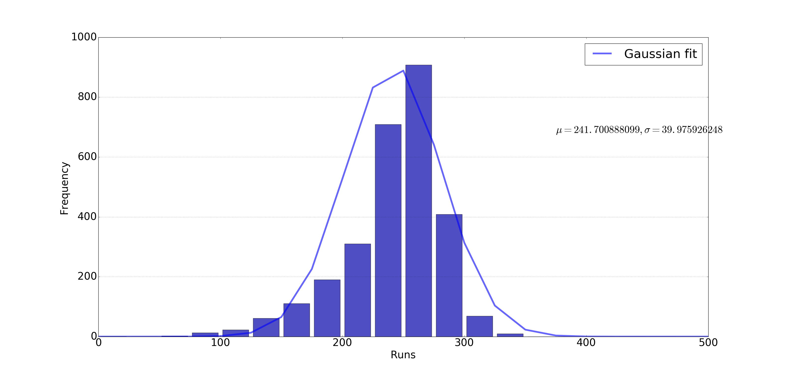

# Format of simulation.txt

`simulation.txt` generated by running:
```
c:\Users\siddjain\cricket\simulation>mvn exec:java -Dexec.mainClass="cricket.Simulation" -Dexec.args="config.yaml 100000" > simulation.txt
```

[config.yaml](config.yaml) contains the probabilities used to simulate a game of cricket.

Example record:
```
2 440 264 6 50.0
```

* Column 1: Thread id
* Column 2: Inning id
* Column 3: Runs
* Column 4: Wickets
* Column 5: Overs

Last line of `simulation.txt` calculates probability of a tie:
```
Prob. of tie = 34208 / 3960705 = 0.0086 
```
0.86%

The denominator is the number of matches simulated. So in above we simulated 3,960,705 matches!

# Histogram of simulated runs

This is generated by running below from parent directory:
```
>>> import histogram
>>> histogram.plot("simulation/simulation.txt", 2)
```

It gives below figure:



This is clearly not a good fit to the actual data. Why the distribution is not normal is puzzling
since according to central limit theorem sum of i.i.d. random variables is normally distributed.

# Chi Square Test between simulated and actual data

We can also do a chi square test to test how well the model fits observed data. To do that:

```
>>> import pandas as pd
>>> actual = pd.read_csv('cricsheet/odi_summary.txt', sep=" ", header=None)
>>> predic = pd.read_csv('simulation/simulation.txt', sep=" ", header=None)
>>> bins = np.linspace(start=90, stop=350, num=21, endpoint=True)
>>> f_exp, _ = np.histogram(predic[2], bins)
>>> f_obs, _ = np.histogram(actual[1], bins)
>>> f_obs
array([ 24,  37,  79,  80,  98, 115, 131, 136, 150, 200, 208, 218, 237,
       174, 195, 154, 123, 106,  90,  71], dtype=int64)
>>> f_exp
array([ 13,  10,  13,  23,  47,  50,  63,  74, 127, 126, 213, 297, 469,
       461, 395, 240, 129,  40,  13,   6], dtype=int64)
>>> res = chisquare(f_obs, f_exp)
>>> res
Power_divergenceResult(statistic=2587.4282881000086, pvalue=0.0)
```

The fit is pretty bad as we can already see visually comparing histograms of simulated
vs. actual runs. In above, the bins are starting from 90 and ending
at 350 to ensure the frequency counts in each bin is at least 5 otherwise the test returns
nan. This is documented at https://docs.scipy.org/doc/scipy/reference/generated/scipy.stats.chisquare.html which says:

This test is invalid when the observed or expected frequencies in each category are too small. A typical rule is that all of the observed and expected frequencies should be at least 5.